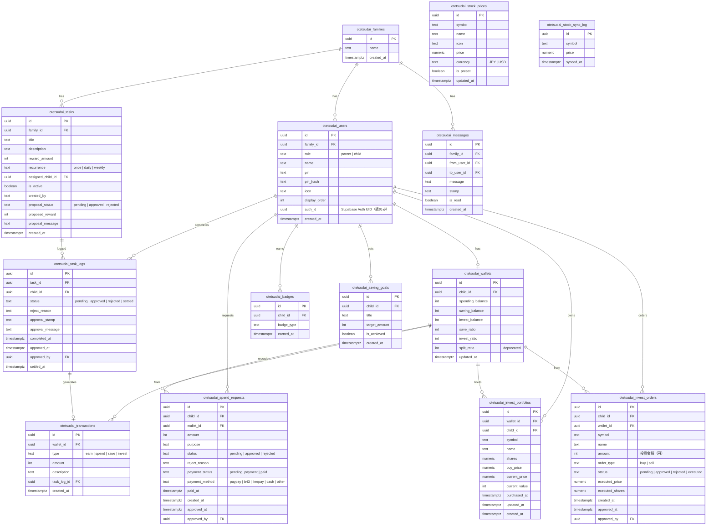
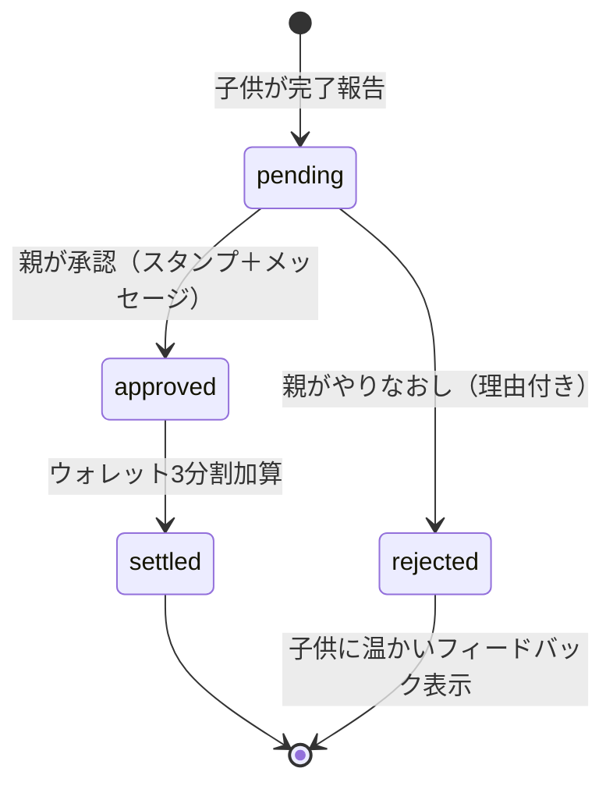
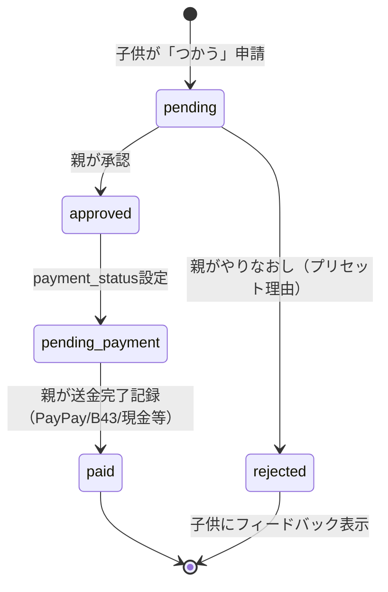
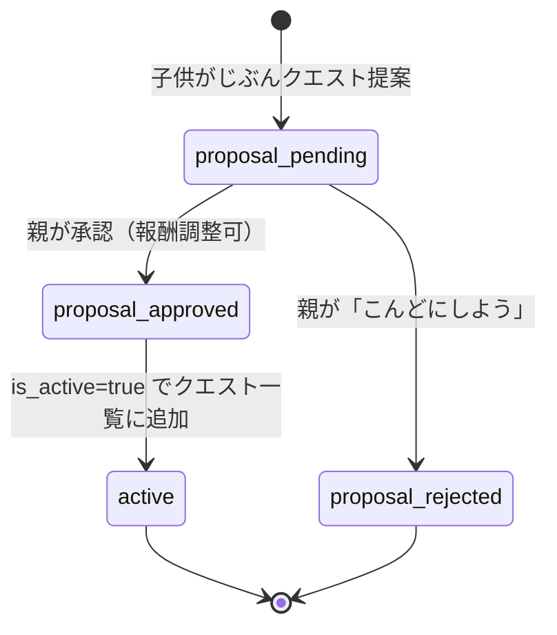
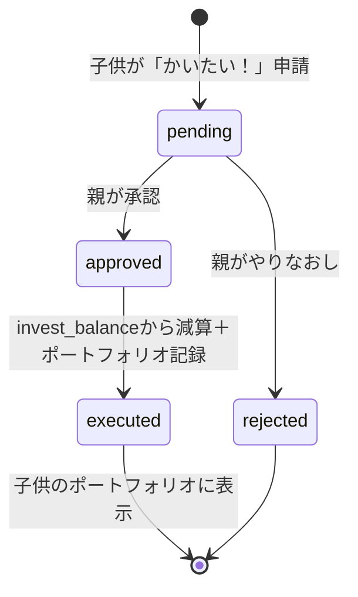

# おこづかいクエスト ER図・ステータス遷移図

## ER図（全テーブル）



## ステータス遷移図

### クエスト完了フロー



### 支出申請フロー



### クエスト提案フロー



### 投資注文フロー



## 報酬の遷移（ライフサイクル）

```
┌─────────────────────────────────────────────────────────┐
│                    報酬のライフサイクル                      │
├─────────────────────────────────────────────────────────┤
│                                                         │
│  クエスト完了(pending)                                    │
│       │                                                 │
│       ├──→ 親承認(approved) ──→ 3分割加算                │
│       │         │                                       │
│       │         ├──→ 💰つかう(spending_balance)          │
│       │         │         │                             │
│       │         │         └──→ 支出申請 → 親承認         │
│       │         │                   → 送金待ち → 送金済み │
│       │         │                                       │
│       │         ├──→ 🐷ためる(saving_balance)            │
│       │         │         │                             │
│       │         │         └──→ 貯金目標の進捗に反映       │
│       │         │                                       │
│       │         └──→ 🌱ふやす(invest_balance)            │
│       │                   │                             │
│       │                   └──→ 投資注文 → 親承認         │
│       │                             → ポートフォリオ記録  │
│       │                             → 株価同期で評価額更新 │
│       │                                                 │
│       └──→ やりなおし(rejected)                          │
│                   → 子供にフィードバック                   │
│                                                         │
└─────────────────────────────────────────────────────────┘
```
